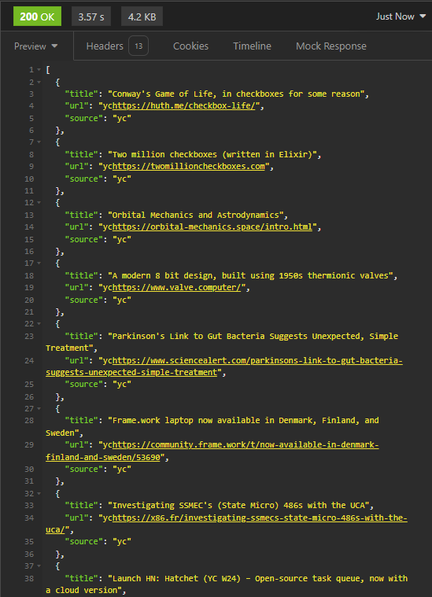
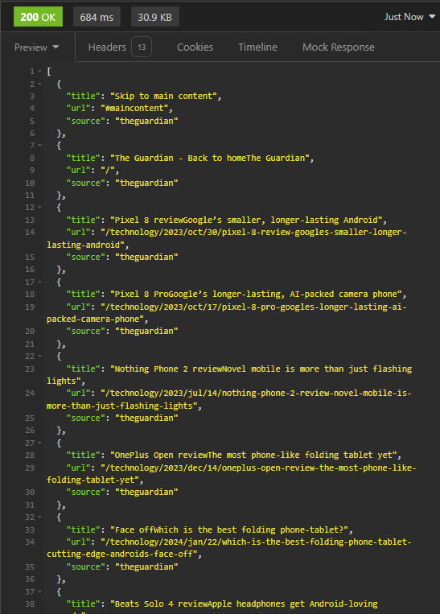

### CodeNexus API 

[!IMPORTANT]  
> This API is intended solely for educational purposes and is not suitable for use in any production environments. Since it is running on a free serverless platform, it may experience high latency and is not designed for high-performance needs.

Welcome to the CodeNexus API documentation. This API allows you to retrieve tech news from various sources around the world using simple GET commands.

### Tests (Tested on Insomnia)




### To use this API visit: [Here](https://rapidapi.com/vasantmogia05/api/codenexus)
### Direct site: [Here](https://technews.koyeb.app/news)

#### Base URL

The base URL for accessing the CodeNexus API is:

```
https://your-api-base-url
```

### Supported sources right now: 

- CNBC
- TechCrunch
- Guardian
- Ycombinator

### Usage: 

- Since this API is deployed on a serverless platform and RapidAPI, it is recommended that all users check the RapidAPI website for this API to find Node.js code snippets. 
- This API cannot handle a high load as it is running on a free server, so it is mainly intended for personal projects and not for any other uses.

#### Endpoints

1. **Retrieve All Tech News**

   Endpoint:
   ```
   GET /news
   ```

   Description:
   This endpoint retrieves all types of tech news from every available source worldwide.

   Example:
   ```
   GET https://technews.koyeb.app/news
   ```

2. **Retrieve Tech News from a Specific Source**

   Endpoint:
   ```
   GET https://technews.koyeb.app/news/{source}
   ```

   Description:
   This endpoint retrieves tech news specifically from the source specified by `{source}`. Replace `{source}` with a supported source identifier such as `yc` (Y Combinator), `theguardian` (The Guardian), `cnbc` (CNBC), `techcrunch` (TechCrunch), etc.

   Example:
   ```
   GET https://technews.koyeb.app/news/techcrunch
   ```

#### Response Format

The API response for both endpoints will typically be in JSON format and include structured data containing news articles, headlines, publication dates, URLs, and other relevant metadata depending on the source.

#### Error Handling

- If the requested source does not exist or is not supported, the API will return an appropriate error response with a corresponding HTTP status code (e.g., 404 Not Found).

#### Rate Limits

The API may impose rate limits to ensure fair usage and maintain performance. Please refer to the API documentation or headers in the API responses for rate limit information.

#### Example Usage

```bash
# Retrieve all tech news
curl -X GET "https://technews.koyeb.app/news"

# Retrieve tech news from TechCrunch
curl -X GET "https://technews.koyeb.app/news/yc"
```

#### Notes

- Ensure to replace `https://technews.koyeb.app/news` with the actual base URL provided to you for accessing the API.
- Always check the specific documentation or support provided by the API.
- Documentation provided by [the-SINFUL](https://github.com/the-SINFUL)
